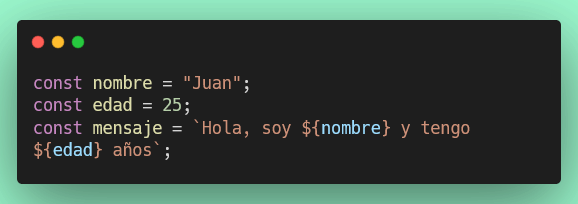

# Ejercicio 1: Variables y Tipos de Datos en JavaScript

## Configuración del Entorno de Desarrollo

### Instalación de Docker y DevContainer

Antes de comenzar, asegúrate de tener Docker instalado y configurado:

1. **Instalar Docker Desktop:**
   - Descarga Docker Desktop desde [https://www.docker.com/products/docker-desktop](https://www.docker.com/products/docker-desktop)
   - Sigue las instrucciones de instalación para tu sistema operativo
   - Inicia Docker Desktop y verifica que esté ejecutándose

2. **Abrir el proyecto en DevContainer:**
   - Abre VS Code en la carpeta del proyecto
   - Instala la extensión "Dev Containers" de Microsoft si no la tienes
   - Presiona `F1` o `Ctrl+Shift+P` (Cmd+Shift+P en Mac)
   - Escribe y selecciona: **"Dev Containers: Reopen in Container"**
   - Espera a que el contenedor se construya e inicie (puede tardar unos minutos la primera vez)

## Cómo visualizar este ejercicio

Para ver tu trabajo en el navegador mientras desarrollas:

1. Asegúrate de tener la extensión **Live Server** instalada en VS Code
2. Abre el archivo `src/index.html` 
3. Haz clic derecho en el archivo y selecciona **"Open with Live Server"**
4. Tu navegador se abrirá automáticamente mostrando la página
5. Los cambios se actualizarán automáticamente al guardar

## Objetivo
Aprender a declarar variables usando `let`, `const` y `var`, y trabajar con los tipos de datos primitivos de JavaScript.

## Instrucciones

Crea los siguientes archivos en la carpeta `src/ejercicio-1/`:
- `variables.html`
- `variables.js`

### Requisitos del HTML (`variables.html`)

Crea un documento HTML básico que:
1. Tenga un título "Ejercicio 1: Variables y Tipos de Datos"
2. Incluya un `<div>` con id `"output"` para mostrar resultados
3. Enlace el archivo JavaScript `variables.js`
4. Aplicar estilos básicos para mejorar la presentación (por ejemplo, márgenes, colores, fuentes).


### Requisitos del JavaScript (`variables.js`)

Debes declarar las siguientes variables con los valores especificados:

#### 1. Variables con `let`
- `nombre`: tu nombre (string)
- `edad`: tu edad (number)
- `esEstudiante`: true (boolean)

#### 2. Variables con `const`
- `PI`: 3.14159 (number)
- `DIAS_SEMANA`: 7 (number)
- `MI_EMAIL`: tu email (string)

#### 3. Trabajando con tipos de datos
Declara las siguientes variables usando `let`:
- `numeroEntero`: cualquier número entero
- `numeroDecimal`: cualquier número decimal
- `textoSimple`: una cadena de texto con comillas simples
- `textoDoble`: una cadena de texto con comillas dobles
- `textoTemplate`: una cadena usando template literals (backticks) que incluya al menos una variable
- `verdadero`: el valor booleano true
- `falso`: el valor booleano false
- `indefinido`: el valor undefined
- `nulo`: el valor null

#### 4. Concatenación y Template Literals
Crea las siguientes variables:
- `saludo`: una concatenación usando el operador `+` que diga "Hola, mi nombre es [nombre]"
- `presentacion`: usando template literals, crea un mensaje que diga "Me llamo [nombre], tengo [edad] años y soy estudiante: [esEstudiante]"

#### 5. Operaciones básicas
Declara estas variables con operaciones:
- `suma`: la suma de dos números cualesquiera
- `resta`: la resta de dos números
- `multiplicacion`: la multiplicación de dos números
- `division`: la división de dos números
- `modulo`: el módulo (resto) de una división

## Conceptos Clave

### Variables
- **let**: para variables que pueden cambiar su valor
- **const**: para constantes que no cambiarán
- **var**: forma antigua (evitar usar en código moderno)

### Tipos de Datos Primitivos
1. **String**: texto ("hola", 'mundo', \`template\`)
2. **Number**: números (42, 3.14, -10)
3. **Boolean**: verdadero o falso (true, false)
4. **Undefined**: variable declarada sin valor
5. **Null**: ausencia intencional de valor
6. **Symbol**: identificador único (avanzado)
7. **BigInt**: números muy grandes (avanzado)

### Template Literals



## Validación

Ejecuta las pruebas con:
```bash
npm test 1-variables-tipos.test.js
```

## Recursos
- [MDN: Variables](https://developer.mozilla.org/es/docs/Web/JavaScript/Guide/Grammar_and_types#declaraciones)
- [MDN: Tipos de Datos](https://developer.mozilla.org/es/docs/Web/JavaScript/Data_structures)
- [MDN: Template Literals](https://developer.mozilla.org/es/docs/Web/JavaScript/Reference/Template_literals)
