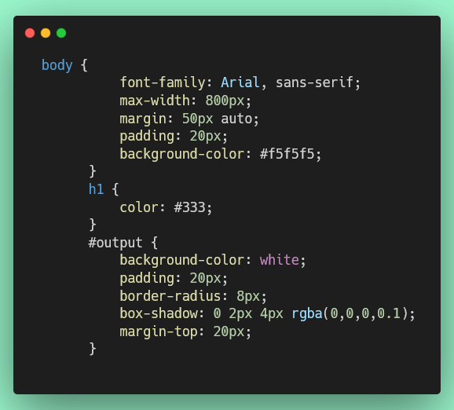

# Ejercicio 5: Funciones Básicas en JavaScript

## Configuración del Entorno de Desarrollo

### Instalación de Docker y DevContainer

Antes de comenzar, asegúrate de tener Docker instalado y configurado:

1. **Instalar Docker Desktop:**
   - Descarga Docker Desktop desde [https://www.docker.com/products/docker-desktop](https://www.docker.com/products/docker-desktop)
   - Sigue las instrucciones de instalación para tu sistema operativo
   - Inicia Docker Desktop y verifica que esté ejecutándose

2. **Abrir el proyecto en DevContainer:**
   - Abre VS Code en la carpeta del proyecto
   - Instala la extensión "Dev Containers" de Microsoft si no la tienes
   - Presiona `F1` o `Ctrl+Shift+P` (Cmd+Shift+P en Mac)
   - Escribe y selecciona: **"Dev Containers: Reopen in Container"**
   - Espera a que el contenedor se construya e inicie (puede tardar unos minutos la primera vez)

## Cómo visualizar este ejercicio

Para ver tu trabajo en el navegador mientras desarrollas:

1. Asegúrate de tener la extensión **Live Server** instalada en VS Code
2. Abre el archivo `src/index.html` 
3. Haz clic derecho en el archivo y selecciona **"Open with Live Server"**
4. Tu navegador se abrirá automáticamente mostrando la página
5. Los cambios se actualizarán automáticamente al guardar

## Objetivo
Dominar la declaración y uso de funciones, incluyendo parámetros, valores de retorno, y el concepto de scope (ámbito de las variables).

## Instrucciones

Crea los siguientes archivos en la carpeta `src/ejercicio-5/`:
- `funciones.html`
- `funciones.js`

### Requisitos del HTML (`funciones.html`)

Crea un documento HTML básico que:
1. Tenga un título "Ejercicio 5: Funciones Básicas"
2. Incluya un `<div>` con id `"output"` para mostrar resultados
3. Incluya botones para ejecutar diferentes funciones
4. Enlace el archivo JavaScript `funciones.js`
6. Aplicar estilos básicos para mejorar la presentación (por ejemplo, márgenes, colores, fuentes).



### Requisitos del JavaScript (`funciones.js`)

#### 1. Función sin Parámetros
Crea una función `saludar` que:
- No reciba parámetros
- Retorne el string "¡Hola, mundo!"

#### 2. Función con Un Parámetro
Crea una función `saludarPersona` que:
- Reciba un parámetro `nombre`
- Retorne "¡Hola, [nombre]!"
- Ejemplo: `saludarPersona("Ana")` retorna "¡Hola, Ana!"

#### 3. Función con Múltiples Parámetros
Crea una función `sumar` que:
- Reciba dos parámetros: `a` y `b`
- Retorne la suma de ambos números

#### 4. Función con Parámetros por Defecto
Crea una función `crearMensaje` que:
- Reciba dos parámetros: `texto` y `veces` (con valor por defecto 1)
- Retorne el texto repetido `veces` veces separado por espacios
- Ejemplo: `crearMensaje("Hola", 3)` retorna "Hola Hola Hola"
- Ejemplo: `crearMensaje("Hola")` retorna "Hola"

#### 5. Función que Retorna un Objeto
Crea una función `crearPersona` que:
- Reciba tres parámetros: `nombre`, `edad`, `ciudad`
- Retorne un objeto con esas propiedades
- Ejemplo: `crearPersona("Juan", 25, "Madrid")` retorna `{nombre: "Juan", edad: 25, ciudad: "Madrid"}`

#### 6. Función que Retorna Múltiples Valores (Array)
Crea una función `operacionesMatematicas` que:
- Reciba dos parámetros: `num1` y `num2`
- Retorne un array con: suma, resta, multiplicación y división
- Ejemplo: `operacionesMatematicas(10, 2)` retorna `[12, 8, 20, 5]`

#### 7. Función con Validación
Crea una función `dividir` que:
- Reciba dos parámetros: `dividendo` y `divisor`
- Si el divisor es 0, retorne "Error: No se puede dividir por cero"
- Si no, retorne el resultado de la división
- Ejemplo: `dividir(10, 2)` retorna `5`
- Ejemplo: `dividir(10, 0)` retorna `"Error: No se puede dividir por cero"`

#### 8. Scope Local
Crea una función `calcularTotal` que:
- Reciba un parámetro `precio`
- Declare una variable local `impuesto` con valor 0.21 (21%)
- Declare una variable local `total` que sea precio + (precio * impuesto)
- Retorne el total
- Ejemplo: `calcularTotal(100)` retorna `121`

#### 9. Scope Global y Local
Declara una variable global `contador` con valor 0.
Crea una función `incrementarContador` que:
- Incremente la variable global `contador` en 1
- Retorne el nuevo valor de `contador`

#### 10. Función que Llama a Otra Función
Crea una función `esPar` que:
- Reciba un parámetro `numero`
- Retorne `true` si es par, `false` si es impar

Crea una función `filtrarPares` que:
- Reciba un parámetro `numeros` (array)
- Use la función `esPar` para filtrar
- Retorne un array solo con los números pares
- Ejemplo: `filtrarPares([1, 2, 3, 4, 5])` retorna `[2, 4]`

#### 11. Función Recursiva Simple
Crea una función `factorial` que:
- Reciba un parámetro `n`
- Calcule el factorial de forma recursiva
- Retorne el resultado
- Ejemplo: `factorial(5)` retorna `120` (5 * 4 * 3 * 2 * 1)
- Caso base: `factorial(0)` o `factorial(1)` retorna `1`

#### 12. Expresión de Función
Crea una expresión de función asignada a la variable `multiplicar` que:
- Reciba dos parámetros: `a` y `b`
- Retorne la multiplicación
- Ejemplo: `multiplicar(3, 4)` retorna `12`

#### 13. Función con Rest Parameters
Crea una función `sumarTodos` que:
- Use rest parameters (`...numeros`) para aceptar cualquier cantidad de argumentos
- Retorne la suma de todos los números
- Ejemplo: `sumarTodos(1, 2, 3, 4, 5)` retorna `15`
- Ejemplo: `sumarTodos(10, 20)` retorna `30`

#### 14. Función que Retorna Función
Crea una función `crearMultiplicador` que:
- Reciba un parámetro `factor`
- Retorne una nueva función que reciba un número y lo multiplique por `factor`
- Ejemplo:
  ```javascript
  const duplicar = crearMultiplicador(2);
  duplicar(5); // retorna 10
  const triplicar = crearMultiplicador(3);
  triplicar(5); // retorna 15
  ```

## Conceptos Clave

### Declaración de Función
```javascript
function nombreFuncion(parametro1, parametro2) {
  // código
  return resultado;
}
```

### Expresión de Función
```javascript
const miFuncion = function(parametro) {
  return resultado;
};
```

### Parámetros por Defecto
```javascript
function saludar(nombre = "Invitado") {
  return `Hola, ${nombre}`;
}
```

### Rest Parameters
```javascript
function sumar(...numeros) {
  return numeros.reduce((a, b) => a + b, 0);
}
```

### Scope (Ámbito)
- **Global**: Variables declaradas fuera de funciones
- **Local**: Variables declaradas dentro de funciones
- **Block**: Variables con `let` y `const` tienen scope de bloque

### Funciones Recursivas
Una función que se llama a sí misma debe tener:
1. Un caso base (condición de salida)
2. Un caso recursivo (llamada a sí misma)

## Validación

Ejecuta las pruebas con:
```bash
npm test 5-funciones.test.js
```

## Recursos
- [MDN: Funciones](https://developer.mozilla.org/es/docs/Web/JavaScript/Guide/Functions)
- [MDN: Parámetros por Defecto](https://developer.mozilla.org/es/docs/Web/JavaScript/Reference/Functions/Default_parameters)
- [MDN: Rest Parameters](https://developer.mozilla.org/es/docs/Web/JavaScript/Reference/Functions/rest_parameters)
- [MDN: Scope](https://developer.mozilla.org/es/docs/Glossary/Scope)
- [MDN: Recursión](https://developer.mozilla.org/es/docs/Glossary/Recursion)
